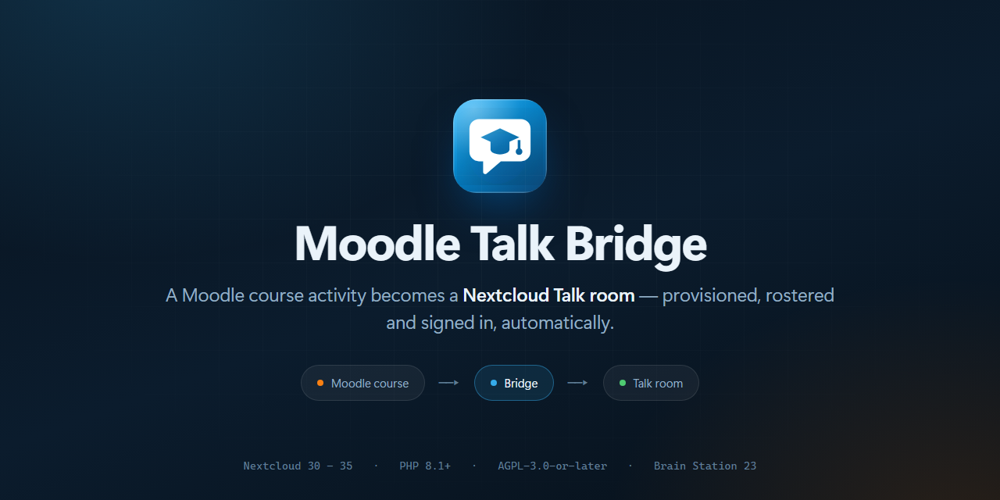
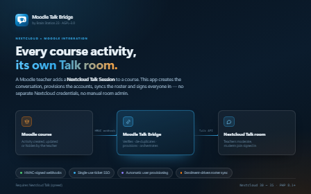
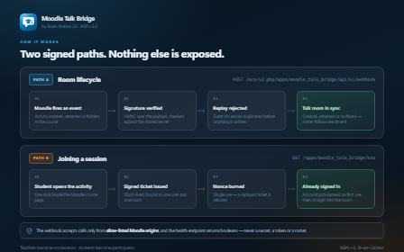
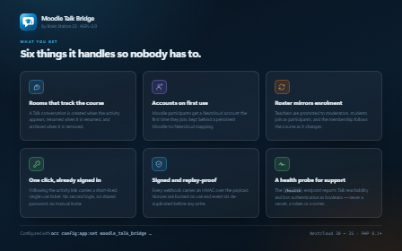
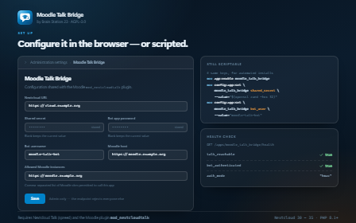

<p align="center">
  
</p>

# Moodle Talk Bridge

[](COPYING)

Nextcloud companion app for the Moodle **Nextcloud Talk Session** activity
(`mod_nextcloudtalk`). It lets a Moodle course create a Nextcloud Talk room and
drop teachers and students straight into it, without them needing to manage
separate Nextcloud credentials.

This app is the Nextcloud half of the integration.

## Getting the Moodle plugin

The companion Moodle activity plugin (`mod_nextcloudtalk`) is supplied directly
by Brain Station 23 rather than through the Moodle plugins directory. Both halves
are required — this app does nothing on its own.

To request the plugin, or for installation and support enquiries, contact
**<elearning@brainstation-23.com>**.

## What it does

- Receives HMAC-signed webhooks from Moodle and creates, updates or archives
  the matching Talk conversation.
- Provisions Nextcloud accounts for Moodle participants on first use and keeps
  a persistent Moodle-user to Nextcloud-user mapping.
- Syncs the room roster with course enrolment: teachers become moderators,
  students become regular participants.
- Issues and verifies signed single-use tickets, so a user following the
  activity link from Moodle lands in the conversation already signed in.
- Exposes a health endpoint backing the "Test connection" button on the
  Moodle side.

## Screenshots

| | |
| --- | --- |
| [](screenshots/01-overview.png) | [](screenshots/02-how-it-works.png) |
| [](screenshots/03-capabilities.png) | [](screenshots/04-setup.png) |

## Requirements

- Nextcloud 30–35
- PHP 8.1+
- **[Nextcloud Talk (`spreed`)](https://apps.nextcloud.com/apps/spreed) installed
  and enabled** — this app drives Talk and does nothing without it.
- A dedicated Nextcloud bot account with an app password.

## Installation

From the App Store: search for *Moodle Talk Bridge* in **Apps → Integration**.

Manually:

```bash
# The directory name must be exactly `moodle_talk_bridge`.
cp -r moodle_talk_bridge /var/www/html/custom_apps/
occ app:enable moodle_talk_bridge
```

No build step is required — the app ships no compiled frontend assets and has
no runtime Composer dependencies.

## Configuration

Set everything from **Administration settings → Moodle Talk Bridge**. The two
secrets are write-only in the panel: they render as placeholders, and leaving a
secret field blank keeps the stored value.

Every key can also be applied with `occ`, which is the better route for scripted
or automated installs.

```bash
occ config:app:set moodle_talk_bridge shared_secret     --value="<32-byte hex>"
occ config:app:set moodle_talk_bridge nextcloud_url     --value="https://cloud.example.org"
occ config:app:set moodle_talk_bridge bot_user          --value="moodle-talk-bot"
occ config:app:set moodle_talk_bridge bot_app_password  --value="<app password>"
occ config:app:set moodle_talk_bridge allowed_instances --value="https://moodle.example.org"
occ config:app:set moodle_talk_bridge moodle_host       --value="https://moodle.example.org"
```

| Key | Required | Default | Description |
| --- | --- | --- | --- |
| `shared_secret` | yes | — | HMAC secret; must match the Moodle plugin's setting. |
| `nextcloud_url` | yes | — | Base URL this app uses to reach its own Talk API. |
| `bot_user` | yes | — | Nextcloud account that owns the rooms. |
| `bot_app_password` | yes | — | App password for `bot_user`. |
| `allowed_instances` | yes | — | Comma-separated Moodle origins allowed to call the webhook. |
| `moodle_host` | yes | — | Moodle base URL used when linking back. |
| `auth_mode` | no | `hmac` | Reported by the health endpoint. `hmac` is the only supported mode. |

Generate the shared secret with `openssl rand -hex 32` and set the identical
value on both sides.

> **Note:** `bot_app_password` is stored in Nextcloud's app configuration. Treat
> the value as a credential, scope the bot account to the minimum it needs, and
> rotate it if the database is ever exposed.

## Endpoints

| Route | Auth | Purpose |
| --- | --- | --- |
| `POST /ocs/v2.php/apps/moodle_talk_bridge/api/v1/webhook` | HMAC signature | Room lifecycle events from Moodle. |
| `GET /apps/moodle_talk_bridge/sso` | Signed single-use ticket | Authenticated join and redirect into the room. |
| `GET /apps/moodle_talk_bridge/health` | Public | Talk reachability and bot auth probe. Returns booleans only, never secrets. |

## Development

Most of the suite extends Nextcloud's own `Test\TestCase`, so the tests must run
**inside a Nextcloud installation**, with the app checked out at the same depth
as core apps (e.g. `custom_apps/moodle_talk_bridge`). Running them on the host
fails with `Class "Test\TestCase" not found`.

```bash
# inside the Nextcloud container / server
cd custom_apps/moodle_talk_bridge
composer install
composer exec phpunit -- -c phpunit.xml
```

## Building a release

```bash
make appstore OCC=/var/www/html/occ
```

This stages a clean copy (no tests, no Composer files, no `vendor/`), signs it
with `occ integrity:sign-app`, writes `build/moodle_talk_bridge.tar.gz`, and
prints the base64 signature to paste into the App Store upload form. Signing
happens before packaging — any change made afterwards invalidates the signature.

## License

Licensed under the GNU Affero General Public License v3.0 or later. See
[COPYING](COPYING).
